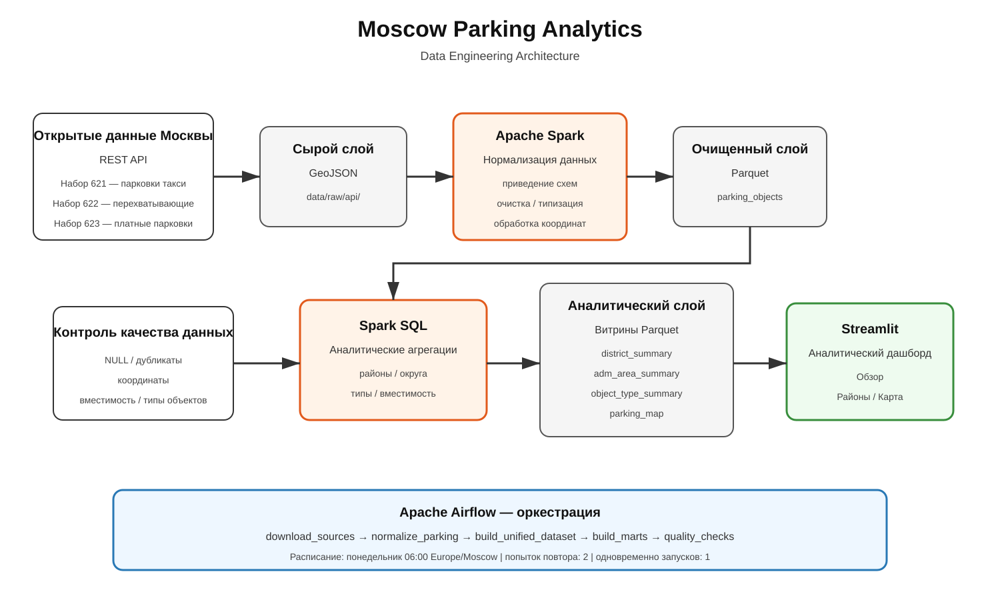

# Moscow Parking Analytics

Аналитическая платформа парковочной инфраструктуры Москвы на основе открытых данных Правительства Москвы.

Проект реализует полный Data Engineering pipeline:

- автоматическая загрузка данных из REST API;
- обработка и нормализация данных в Apache Spark;
- формирование RAW, Silver и Gold слоёв;
- проверки качества данных;
- оркестрация через Apache Airflow;
- аналитический dashboard на Streamlit;
- автоматические тесты Spark-трансформаций.

---

## Цель проекта

Цель проекта — создать единый аналитический сервис для анализа парковочной инфраструктуры Москвы.

Используются три набора открытых данных:

| Dataset ID | Набор данных |
|---:|---|
| 621 | Парковки такси |
| 622 | Перехватывающие парковки |
| 623 | Платные парковки |

Исходные наборы имеют разные структуры и различные способы представления географических данных.

**Apache Spark является центральным компонентом обработки данных:** он нормализует источники, объединяет данные, выполняет преобразования и формирует аналитические витрины.

---

## Архитектура проекта



## Data Pipeline

Airflow DAG состоит из пяти последовательных задач:

```text
download_sources
        |
        v
normalize_parking
        |
        v
build_unified_dataset
        |
        v
build_marts
        |
        v
quality_checks
```

### 1. `download_sources`

Получает данные из API Портала открытых данных Москвы.

Для каждого набора:

- получает ожидаемое количество объектов через endpoint `/count`;
- загружает объекты через `/features`;
- поддерживает пагинацию;
- сверяет фактическое и ожидаемое количество объектов;
- сохраняет данные в RAW-слой в формате GeoJSON.

### 2. `normalize_parking`

Apache Spark приводит три различных источника к единой модели данных:

```text
global_id
object_type
parking_name
adm_area
district
address
longitude
latitude
capacity
schedule
source
load_date
```

Используются три типа объектов:

```text
TAXI_PARKING
INTERCEPT_PARKING
PAID_PARKING
```

Для парковок такси и перехватывающих парковок API возвращает геометрию `Point`.

Для платных парковок API возвращает `MultiLineString`. Spark рассчитывает репрезентативную точку объекта на основе координат геометрии.

### 3. `build_unified_dataset`

Нормализованные источники объединяются в единый Silver dataset:

```text
parking_objects
```

Данные сохраняются в формате Parquet с партиционированием по:

```text
object_type
```

### 4. `build_marts`

С помощью Spark SQL формируются четыре Gold-витрины:

- `district_summary` — показатели по районам;
- `adm_area_summary` — показатели по административным округам;
- `object_type_summary` — статистика по типам парковок;
- `parking_map` — данные для отображения объектов на карте.

### 5. `quality_checks`

После построения витрин выполняются автоматические Data Quality проверки.

---

## Data Quality

Для Silver-слоя проверяются обязательные поля:

```text
global_id
object_type
parking_name
adm_area
district
longitude
latitude
capacity
```

Проверки:

```text
dataset не пустой
обязательные поля не NULL
capacity > 0
longitude находится в допустимом диапазоне
latitude находится в допустимом диапазоне
нет дублей global_id + object_type
присутствуют ожидаемые object_type
```

Поля:

```text
address
schedule
```

могут содержать `NULL`, если соответствующая информация отсутствует в исходном наборе.

Дополнительно проверяется согласованность Silver и Gold:

```text
Silver object count == Gold object count
Silver total capacity == Gold total capacity
```

---

## Data Layers

### RAW

Необработанные данные, полученные из API:

```text
data/raw/api/
```

Примеры:

```text
data/raw/api/taxi_parking/data.geojson
data/raw/api/intercept_parking/data.geojson
data/raw/api/paid_parking/data.geojson
```

### Silver

Очищенные и нормализованные данные:

```text
data/silver/parking_objects/
```

Формат хранения:

```text
Parquet
```

Партиционирование:

```text
object_type
```

### Gold

Аналитические витрины:

```text
data/gold/district_summary/
data/gold/adm_area_summary/
data/gold/object_type_summary/
data/gold/parking_map/
```

---

## Технологии

В проекте используются:

- Python 3.10
- Apache Spark 3.5.1
- PySpark
- Spark SQL
- Apache Airflow 3.3.1
- Parquet
- GeoJSON
- REST API
- Streamlit 1.63.0
- Plotly 5.9.0
- pytest 8.3.5
- Git
- GitHub

---

## Структура проекта

```text
moscow-parking-analytics/
│
├── README.md
├── requirements.txt
├── requirements-airflow.txt
├── .gitignore
├── .env
│
├── config/
│   └── sources.yaml
│
├── data/
│   ├── raw/
│   │   └── api/
│   │
│   ├── silver/
│   │   ├── staging/
│   │   └── parking_objects/
│   │
│   └── gold/
│       ├── district_summary/
│       ├── adm_area_summary/
│       ├── object_type_summary/
│       └── parking_map/
│
├── src/
│   ├── ingestion/
│   │   └── download_sources.py
│   │
│   ├── jobs/
│   │   ├── normalize_parking.py
│   │   ├── build_unified_dataset.py
│   │   └── build_marts.py
│   │
│   └── quality/
│       └── checks.py
│
├── dags/
│   └── moscow_parking_pipeline.py
│
├── dashboard/
│   └── app.py
│
├── tests/
│   ├── conftest.py
│   ├── test_normalization.py
│   └── test_marts.py
│
└── docs/
    └── business_requirements.md
```

---

## Источники данных

Источник данных:

**Портал открытых данных Правительства Москвы**

```text
https://data.mos.ru
```

API:

```text
https://apidata.mos.ru/v1
```

Используемые наборы:

| Dataset ID | Название |
|---:|---|
| 621 | Парковки такси |
| 622 | Перехватывающие парковки |
| 623 | Платные парковки |

Конфигурация источников:

```text
config/sources.yaml
```

---

## Результаты обработки

На версии данных, использованной при разработке проекта:

| Показатель | Значение |
|---|---:|
| Всего парковочных объектов | 16 127 |
| Парковочных мест | 180 284 |
| Платных парковок | 15 638 |
| Парковок такси | 356 |
| Перехватывающих парковок | 133 |
| Районов | 124 |
| Административных округов | 11 |

---

## Аналитические наблюдения

По текущей версии данных:

- Центральный административный округ содержит наибольшее количество парковочных объектов;
- район Хамовники лидирует по количеству объектов среди районов;
- основную долю объектов составляют платные парковки;
- перехватывающих парковок значительно меньше, но они существенно вместительнее остальных типов;
- средняя вместимость перехватывающей парковки — **147.83 места**;
- средняя вместимость платной парковки — **10.19 места**;
- средняя вместимость парковки такси — **3.62 места**.

Эти выводы относятся к трём используемым наборам открытых данных и не являются полной оценкой всей транспортной инфраструктуры Москвы.

---

# Установка

## Требования

Перед запуском необходимо установить:

```text
Python 3.10
Java 17
Git
```

Проект разрабатывался и тестировался на:

```text
macOS arm64
Python 3.10
Java 17
PySpark 3.5.1
```

---

## Создание окружения проекта

Из корневой директории:

```bash
python3.10 -m venv .venv-project
source .venv-project/bin/activate
```

Обновить pip:

```bash
python -m pip install --upgrade pip
```

Установить зависимости:

```bash
python -m pip install -r requirements.txt
```

---

## API key

Для работы ingestion необходимо получить API-ключ Портала открытых данных Москвы.

В корне проекта создать:

```text
.env
```

Содержимое:

```text
MOS_API_KEY=your_api_key
```

Файл `.env` не должен попадать в GitHub.

---

# Ручной запуск pipeline

Все команды выполняются из корня проекта.

### 1. Загрузка данных

```bash
.venv-project/bin/python src/ingestion/download_sources.py
```

### 2. Spark-нормализация

```bash
.venv-project/bin/python src/jobs/normalize_parking.py
```

### 3. Построение Silver

```bash
.venv-project/bin/python src/jobs/build_unified_dataset.py
```

### 4. Построение Gold

```bash
.venv-project/bin/python src/jobs/build_marts.py
```

### 5. Data Quality

```bash
.venv-project/bin/python src/quality/checks.py
```

При успешном выполнении:

```text
ALL DATA QUALITY CHECKS PASSED
```

---

# Dashboard

Dashboard реализован с помощью Streamlit и Plotly.

Запуск:

```bash
.venv-project/bin/python -m streamlit run dashboard/app.py
```

Открыть:

```text
http://localhost:8501
```

Dashboard содержит три раздела.

### Обзор

Показывает:

- основные KPI;
- количество парковочных объектов;
- количество парковочных мест;
- распределение по административным округам;
- структуру парковочной инфраструктуры;
- вместимость по типам объектов.

### Районы

Содержит:

- TOP районов по количеству объектов;
- показатели районов;
- фильтр по административному округу;
- детальную таблицу.

### Карта

Позволяет:

- посмотреть парковочные объекты Москвы;
- фильтровать их по административному округу;
- фильтровать по типу парковки;
- посмотреть название, адрес, район и вместимость объекта.

---

# Apache Airflow

Airflow используется для оркестрации pipeline.

DAG:

```text
moscow_parking_pipeline
```

Граф задач:

```text
download_sources
        |
        v
normalize_parking
        |
        v
build_unified_dataset
        |
        v
build_marts
        |
        v
quality_checks
```

---

## Расписание Airflow

Pipeline запускается:

```text
каждый понедельник
06:00
Europe/Moscow
```

Cron:

```text
0 6 * * 1
```

Параметры:

```text
retries = 2
retry_delay = 5 минут
max_active_runs = 1
catchup = False
```

---

## Окружение Airflow

Airflow устанавливается отдельно от Spark-приложения:

```bash
python3.10 -m venv .venv-airflow
```

Задать версии:

```bash
AIRFLOW_VERSION=3.3.1
PYTHON_VERSION=3.10
```

Обновить pip:

```bash
.venv-airflow/bin/python -m pip install --upgrade pip
```

Установить Airflow:

```bash
.venv-airflow/bin/python -m pip install \
    -r requirements-airflow.txt \
    --constraint \
    "https://raw.githubusercontent.com/apache/airflow/constraints-${AIRFLOW_VERSION}/constraints-${PYTHON_VERSION}.txt"
```

Проверка:

```bash
.venv-airflow/bin/python -m pip check
```

Ожидаемый результат:

```text
No broken requirements found.
```

---

## Запуск Airflow

Задать переменные:

```bash
export AIRFLOW_HOME="$(pwd)/.airflow"
export AIRFLOW__CORE__DAGS_FOLDER="$(pwd)/dags"
```

Запустить:

```bash
.venv-airflow/bin/airflow standalone
```

Web UI:

```text
http://localhost:8080
```

---

# Тестирование

Запуск всех тестов:

```bash
.venv-project/bin/python -m pytest tests -v
```

Текущий результат:

```text
5 passed
```

Реализованы тесты:

```text
test_normalize_taxi
test_normalize_intercept
test_normalize_paid
test_build_district_summary
test_build_object_type_summary
```

Проверяется:

- Spark-нормализация;
- преобразование типов;
- очистка строк;
- обработка пустых значений;
- получение координат из GeoJSON;
- обработка `MultiLineString`;
- Spark SQL агрегаты;
- бизнес-логика аналитических витрин.

---

# Безопасность

Секреты не хранятся в исходном коде.

В GitHub не должны попадать:

```text
.env
.venv-project/
.venv-airflow/
.airflow/
data/silver/
data/gold/
```

---

# Документация

Бизнес-требования:

```text
docs/business_requirements.md
```

Архитектурная схема:

```text
docs/architecture.png
```

---

## Автор

Учебный проект по Data Engineering и Apache Spark.
